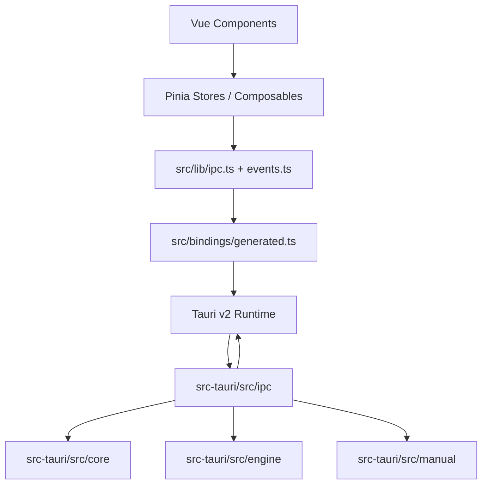

# Canglang 架构总览

Vue 提供交互层，Tauri 提供桌面运行时与 IPC 边界，Rust 实现中国象棋领域与本地能力。

## 组件地图

## 职责

- `BookState` 位于 `ipc/book.rs`，管理 `engine/book` 的开局库服务；与引擎进程状态相互独立。
- `ConfigState` 位于 `ipc/config.rs`，包装 `engine/config::ConfigService`，负责 `config.json` 的读写位置、便携模式检测与原子写入。
- Store 是后端状态的投影与交互协调层，不是第二个棋局事实源。`GameStore` 以快照覆盖可见状态，引擎事件更新实时分析视图。
- `App.vue` 只组合工作区和全局 Dialog；`useAppLifecycle` 负责初始化与跨 store 副作用，`useWorkspaceLayout` 负责响应式面板策略。
- 设置 Dialog 由 `SettingsView.vue` 提供外壳与导航，界面、规则、引擎、开局库、快捷键和关于页分别由 feature tab 负责；引擎设置副作用位于 `useEngineSettings`。

## 主数据流

### 对局走子

棋盘组件把点击位置转换为 ICCS，`useBoard` 调用 `GameStore`，store 经 `commands.makeMove` 请求 Rust。`GameState` 校验走法并更新局面、历史与结果，经 `GameSnapshot` 返回 FEN、走方、结果和历史视图。

### 引擎分析

前端把 FEN、历史 ICCS 与 `AnalysisConfig` 交给 `engine_analyze`。Rust 转为领域对象，`EngineSession` 以选定的 UCI/UCCI 协议驱动外部进程，并把 `ThinkData` 与最佳着法发布为事件；`src/lib/events.ts` 只镜像 Rust payload，typed gateway 由 `src/lib/ipc.ts` 提供，前端仅在 `EngineStore` 订阅和保存。停止、重置或位置快照不匹配时，前端丢弃迟到分析事件。

### 棋谱和开局库

棋谱命令把路径或 `ChessManual` 交给 Rust 服务。`ManualService` 按扩展名分派 PGN/XQF，`OpeningBookService` 管理本地 `.bh` 库与象棋云库，并按当前 `BoardState` 与 `CloudBookMode` 综合查询。前端接收结构化模型，不解析文件字节，也不直接访问云库。

### 配置

前端 `usePreferencesStore` 以 `AppConfig` 整体读写配置：本地 localStorage 作为备份，防抖后经 `configSave` 写入 Rust。`ConfigService` 解析配置文件位置（便携模式取可执行文件同级目录，否则取系统配置目录）并原子替换写入。启动时 `configGetLocation` 的 `exists` 决定是否执行首次运行迁移，配置中的引擎档案与开局库路径在初始化时回填到各 store。

## 运行时状态

启动时 `src-tauri/src/lib.rs` 创建 Tauri builder，注册命令并注入 `GameState`、`EngineState`、`BookState` 与 `ConfigState`。对局以 `Mutex<GameState>` 管理，引擎、开局库与配置各自使用独立异步状态容器。

## 权限边界

`src-tauri/capabilities/default.json` 只授予主窗口实际使用的能力：窗口控制，以及经 `opener` 插件在系统浏览器中打开明确列出的项目与依赖源链接。`opener:allow-open-url` 的 scope 逐条限定 URL 前缀；新增外链时同步扩展 scope，不授予通配 URL 权限。

`core:window:allow-close` 发起关闭请求；`core:window:allow-destroy` 供 Tauri SDK 在关闭监听确认可以退出后销毁主窗口。未保存棋谱的关闭保护见[前端开发](frontend.md)。

## 扩展位置

- 新棋规或表示：扩展 `core`，并为领域行为添加 Rust 测试。
- 新引擎协议：实现 `engine::Protocol`，不在 `EngineSession` 中增加协议分支。
- 新棋谱格式：在 `manual` 中增加解析器，由 `ManualService` 按扩展名分派。
- 新 IPC 能力：在对应 `ipc` 模块添加命令并标记 Specta，重新生成绑定，更新 [IPC 契约](ipc-contract.md)。
- 新配置项：加入 `AppConfig` 与 `usePreferencesStore`，保持读写成对，并更新 IPC 契约的模型表。
- 新 UI 行为：优先扩展现有 store、composable 或组件，领域规则留在 Rust。
